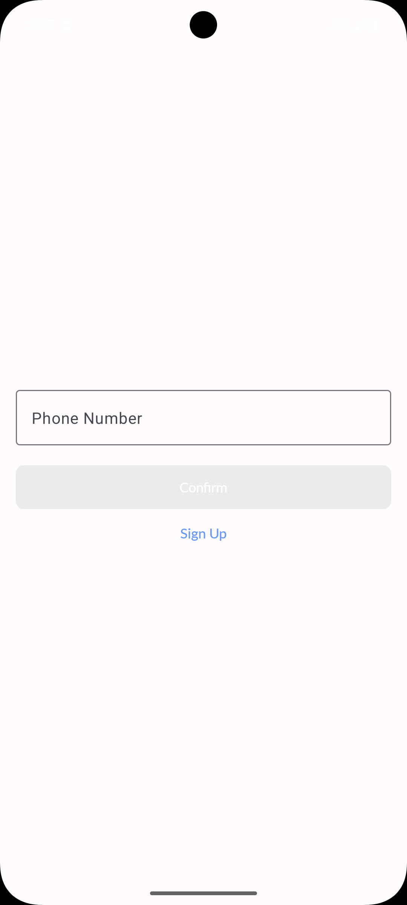
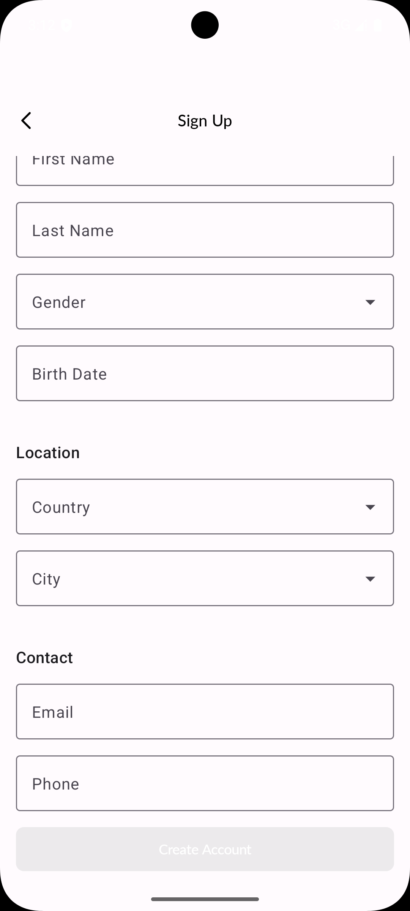
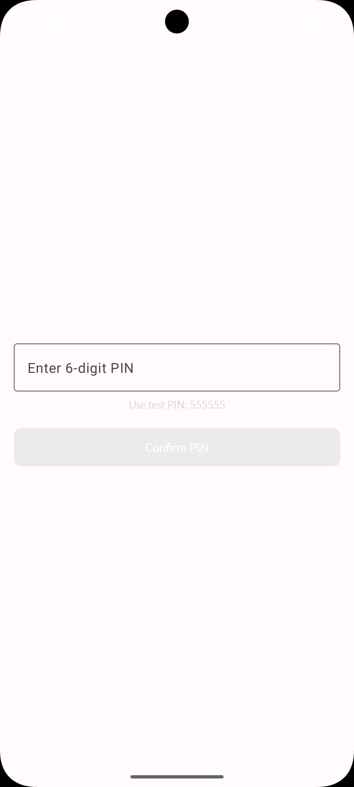
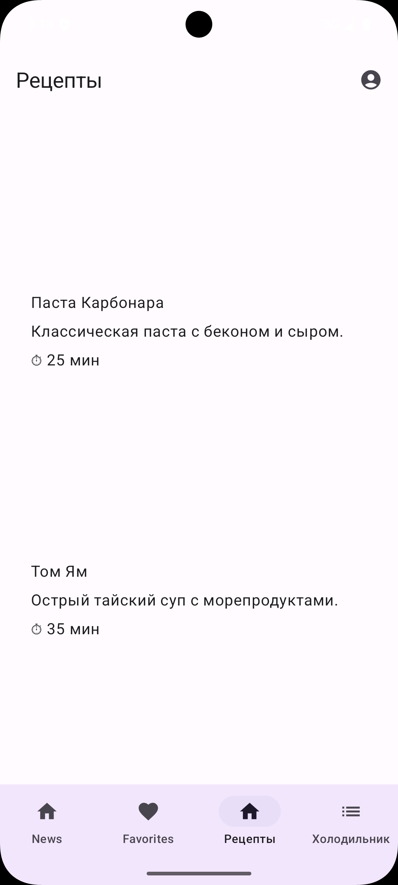
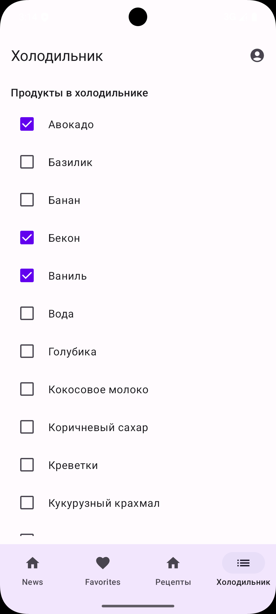
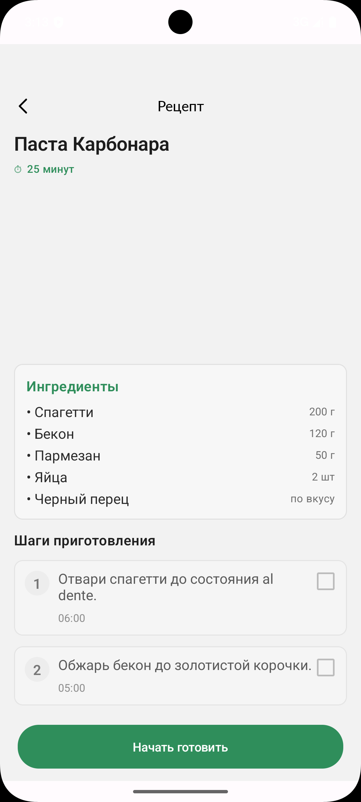

# KursovikKMP - Kotlin Multiplatform Recipe & News App

A modern Android application built with Kotlin Multiplatform (KMP) that combines news browsing, recipe management, and smart fridge inventory tracking in one comprehensive app.

## Features

### Authentication
- **Login Screen** - Secure email/password authentication
- **Sign Up** - User registration with validation
- **PIN Screen** - Additional PIN-based security layer

### Main Features

#### News (Home)
Browse and read articles with a clean, modern interface
- List view of latest news articles
- Article details with full content
- Add articles to favorites

#### Favorites
Manage your favorite articles and recipes
- View all favorited items
- Quick access to saved content
- Detailed view for each favorite

#### Recipes
Discover and cook with detailed recipe instructions
- Browse recipe catalog
- Detailed recipe view with:
  - Step-by-step cooking instructions
  - Ingredient list with checkboxes
  - Cooking time and difficulty
  - Recipe images
- Mark ingredients as available in your fridge

#### Smart Fridge
Intelligent inventory management with recipe recommendations
- Track products in your fridge (checkbox list)
- Get recipe recommendations based on available ingredients
- See which recipes you can make with current ingredients
- Match percentage for recommended recipes

#### Profile
User profile management
- View and edit profile information (name, gender, birth date, location, email, phone)
- Custom profile photo (camera or gallery)
- Logout functionality

## Architecture

This project follows modern Android development best practices with a clean architecture approach:

### Tech Stack

**Core Technologies:**
- **Kotlin Multiplatform (KMP)** - Share business logic across platforms
- **Jetpack Compose** - Modern declarative UI framework
- **Material 3** - Google's latest material design system
- **Coroutines & Flow** - Asynchronous programming
- **Koin** - Dependency injection

**Architecture Components:**
- **MVVM Pattern** - Model-View-ViewModel architecture
- **LCE State Management** - Loading, Content, Error state handling
- **Navigation Component** - Type-safe navigation
- **SQLDelight** - Type-safe database access
- **Ktor** - Network requests (planned)
- **Coil** - Image loading

### Project Structure

```
TestingKMP/
├── androidApp/                    # Android-specific code
│   ├── core/                      # Shared UI components
│   │   └── src/main/java/
│   │       └── com/example/core/
│   │           ├── BaseScreen.kt
│   │           ├── MyButton.kt
│   │           ├── MyTextField.kt
│   │           ├── MyAlertDialog.kt
│   │           ├── MyErrorDialog.kt
│   │           ├── LoadingDialog.kt
│   │           └── Toolbar.kt
│   ├── feature_auth/              # Authentication UI
│   │   └── src/main/java/
│   │       ├── LoginScreen.kt
│   │       ├── SignUpScreen.kt
│   │       └── PinScreen.kt
│   ├── feature_news/              # News UI
│   │   └── src/main/java/
│   │       ├── NewsScreen.kt
│   │       ├── NewsDetailsScreen.kt
│   │       └── ArticleItemView.kt
│   ├── feature_favorites/         # Favorites UI
│   │   └── src/main/java/
│   │       ├── FavoriteScreen.kt
│   │       ├── FavoriteDetailsScreen.kt
│   │       └── FavoriteItemView.kt
│   └── src/main/java/             # Main app code
│       └── com/example/kursovikkmp/android/
│           ├── MainActivity.kt
│           ├── BottomNavigationBar.kt
│           ├── RecipesScreen.kt
│           ├── FridgeScreen.kt
│           ├── ProfileScreen.kt
│           └── Screens.kt
│
└── shared/                        # Shared KMP code
    ├── core/                      # Core shared logic
    │   └── src/commonMain/kotlin/
    │       ├── base/              # Base classes (ViewModel, Event, State)
    │       ├── common/            # Common utilities (LCE, MVVM)
    │       ├── DB/                # Database (SQLDelight)
    │       ├── network/           # Network layer
    │       ├── navigation/        # Navigation service
    │       └── feature/           # Platform-specific features
    ├── news/                      # News feature module
    ├── favorites/                 # Favorites feature module
    ├── fridge/                    # Fridge feature module
    ├── home/                      # Home feature module
    ├── profile/                   # Profile feature module
    └── recipe/                    # Recipe feature module
```

## Key Design Patterns

### MVVM with LCE States
Each screen follows the MVVM pattern with Loading-Content-Error (LCE) state management:
- **ViewModel** - Holds business logic and state
- **State** - Immutable UI state
- **Events** - User interactions
- **Effects** - One-time events (navigation, dialogs)

### Feature Modularity
The app is organized into feature modules, each containing:
- **UI Layer** (androidApp/feature_*) - Compose screens
- **Domain Layer** (shared/*) - ViewModels, business logic, repositories
- **Data Layer** (shared/core) - Database, network, services

### Navigation
Type-safe navigation using Navigation Compose with sealed class routes:
```kotlin
sealed class Screens(val route: String) {
    object Login : Screens("login_screen")
    object Home : Screens("home_screen")
    object Favorites : Screens("favorites_screen")
    object Recipes : Screens("recipes_screen")
    object Fridge : Screens("fridge_screen")
    object Profile : Screens("profile_screen")
}
```

## Setup Instructions

### Prerequisites
- Android Studio Ladybug or newer
- JDK 17 or newer
- Android SDK API 28+ (minimum) / API 35 (target)

### Installation

1. Clone the repository:
```bash
git clone <repository-url>
cd TestingKMP
```

2. Open the project in Android Studio

3. Sync Gradle files

4. Run on an emulator or physical device (API 28+)

### Build Commands

```bash
# Build the project
./gradlew build

# Run on connected device
./gradlew installDebug

# Run tests
./gradlew test
```

## Screenshots

### Authentication Flow
| Login | Sign Up | PIN |
|-------|---------|-----|
|  |  |  |

### Main Screens
| News | Favorites | Recipes | Fridge |
|------|-----------|---------|--------|
|  |  |  |  |

### Detail Views
| News Details | Recipe Details | Profile |
|--------------|----------------|---------|
|  |  |  |

### Fridge Recommendations
| Fridge with Recommendations |
|-----------------------------|
|  |

---

## How to Capture Screenshots

To populate the screenshots, connect an Android device/emulator and run:

```bash
# Start the app
adb shell am start -n com.example.kursovikkmp.android/.MainActivity

# Navigate through screens and capture with:
adb exec-out screencap -p > misc/login.png
adb exec-out screencap -p > misc/signup.png
adb exec-out screencap -p > misc/pin.png
adb exec-out screencap -p > misc/news.png
adb exec-out screencap -p > misc/favorites.png
adb exec-out screencap -p > misc/recipes.png
adb exec-out screencap -p > misc/fridge.png
adb exec-out screencap -p > misc/news_details.png
adb exec-out screencap -p > misc/recipe_details.png
adb exec-out screencap -p > misc/profile.png
adb exec-out screencap -p > misc/fridge_recommendations.png
```

## Testing

The project includes:
- **Unit Tests** - Business logic testing
- **Instrumented Tests** - UI and integration testing

Run tests with:
```bash
./gradlew test                    # Unit tests
./gradlew connectedAndroidTest   # Instrumented tests
```

## Future Enhancements

- iOS app using shared KMP code
- Real backend API integration
- Recipe search and filtering
- Shopping list generation from recipes
- Nutritional information
- Social sharing features
- Recipe ratings and reviews

## License

[Add your license here]

## Contact

[Add your contact information here]
